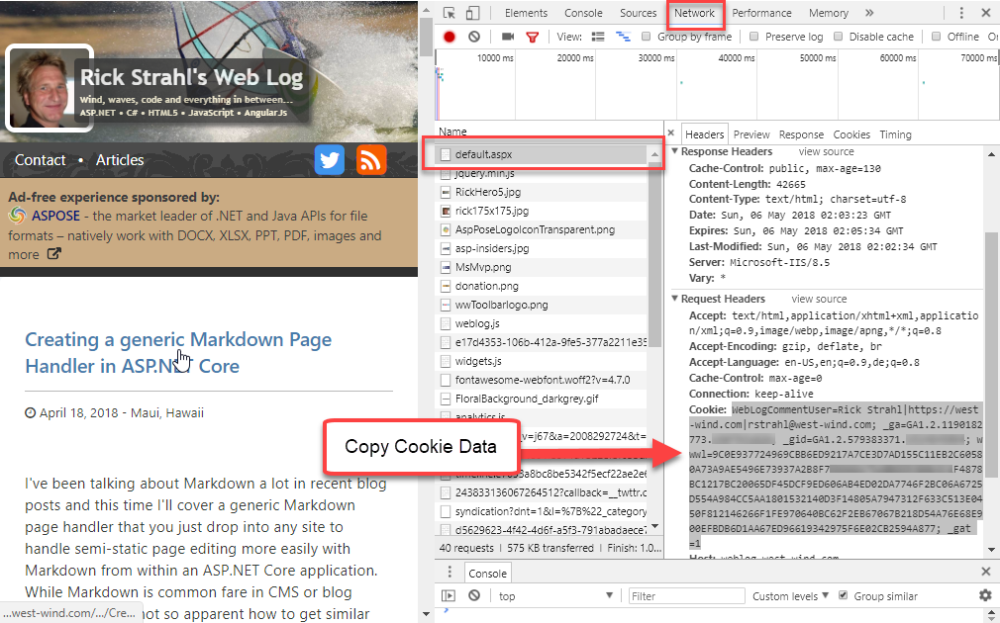
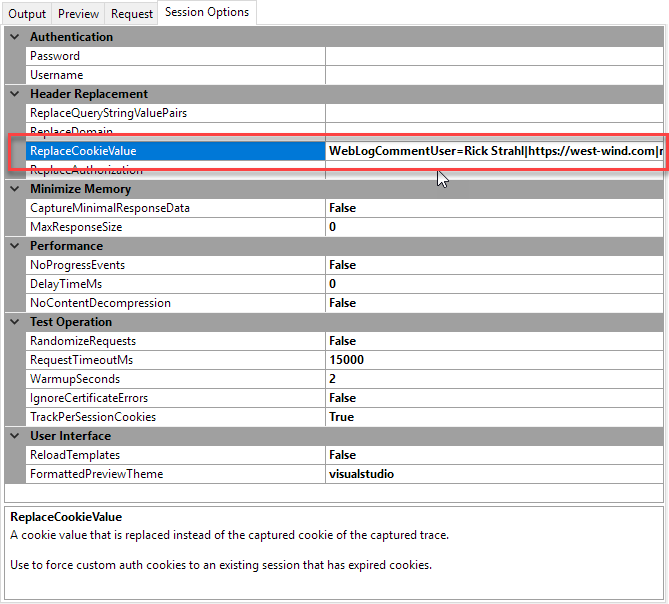

In order to run Web requests on a typical Web site you probably will need to be able to track cookies on the site. HTTP requests natively are stateless and so cookie data is not automatically captured and passed forward.

WebSurge provides a couple of ways to seed Cookie Data:

* Create `Cookie` header in your HTTP request
* Set `ReplaceCookieValue` for a global replacement value
* Use `TrackPerSessionCookies` 

### Setting the Cookie Header
The explicit way to set Cookies is by capturing requests that include a given Cookie header. When you capture requests you the Cookie is part of the captured data.

This works but has a major disadvantages:

> Cookies typically have a timeout associated with them and when the original cookie expires your Cookie header is no longer valid. You either have to update the cookie with a valid cookie, or your can use the `ReplaceCookieValue` session option.

### Set ReplaceCookieValue
As an alternative you can capture a single valid Cookie value via  a tool like Fiddler or via browser Dev tools. The following captures a Cookie via the Chrome Dev Tools (F12 in browser):

You can capture the cookie value and assign it to the **Session Options ->  ReplaceCookieValue** setting.

When you set this value it will override the Cookie value for every request that is sent to the server. This may or may not be what you want, but in most cases this is a quick and easy way to add Cookie values that are valid for your test session.

### Use TrackPerSessionCookies
`TrackPerSessionCookies` as the name suggests works on a single session and essentially captures cookies created by requests and then passes those cookies through the rest of the session. Using this approach you can set up a session that starts with a login request sets a cookie and then access authenticated requests that require that same cookie - the cookie is automatically captured and sent with subsequent requests in that session.

For this to work it's important that you use sessions that include login links that create the Cookie before you access any authenticated links that require Cookie to be present. Order matters in this scenario.

##### TrackPerSessionCookies in Individual Tests
`TrackPerSessionCookies` can also be useful for individual URL tests. The IDE essentially executes individual requests as a single session. So you can run a Login link with a fixed username and password to create an auth cookie, and then hit other requests that expect that cookie and it will be set.

To clear cookies for a project, switch the `TrackPerSessionCookies` flag to `False` and then back to `True`.